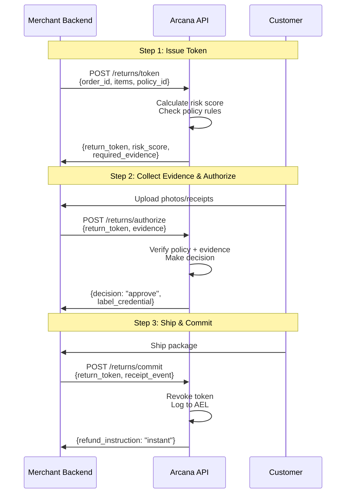
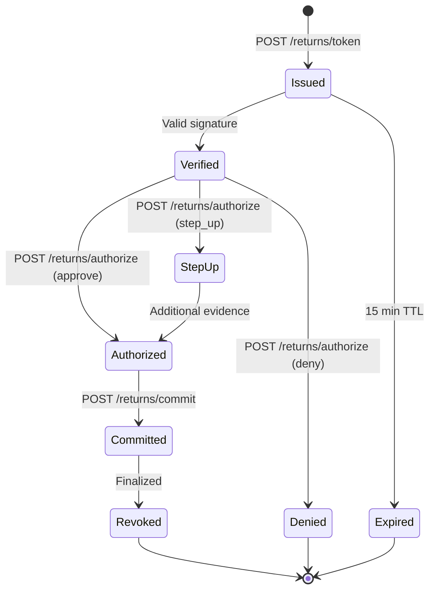

# Arcana Returns API v0.1

**Agentic Returns with Audit-Grade Logging**

## Overview

Arcana provides a minimal API surface for intelligent return decisions with complete auditability. Every decision is bound to a versioned policy snapshot and logged in an append-only ledger (AEL-lite) for time-travel replay.

## Features

### Core API
- **Policy Snapshot Extractor**: Version-controlled policy graphs with content hashing
- **Returns API**: 3 endpoints (`/token`, `/authorize`, `/commit`) with signed Return Tokens (RT)
- **AEL-lite**: Append-only decision ledger with replay capability
- **Shopify Adapter**: Webhook-driven integration
- **Analyst CLI**: Simulate, adjust, and export decisions

### Production Features (NEW! ✨)
- **✅ Idempotency**: Prevent duplicate operations with `Idempotency-Key` header
- **✅ Evidence Validation**: Pre-validate URLs before processing (accessibility, content-type, file size)
- **✅ Webhook Retry**: Exponential backoff with Dead Letter Queue for zero data loss
- **✅ Per-Endpoint Rate Limiting**: Granular rate limits (100/min token, 50/min authorize, etc.)
- **✅ Enhanced Error Messages**: Field-specific errors with actionable suggestions
- **✅ Observability**: Request logging, metrics, health checks, trace IDs
- **✅ Maintenance CLI**: Stats, DLQ retry, rate limit management, cleanup tools

**Status: 100% Production Ready** 🚀

## Quick Start

**⚡ New to Arcana?** See **[QUICKSTART.md](./QUICKSTART.md)** for a 5-minute getting started guide!

**📋 Deploying to production?** See **[PRODUCTION_READINESS.md](./PRODUCTION_READINESS.md)** for the complete checklist.

### Prerequisites

- Node.js 20+
- OpenSSL (for key generation)

### Installation

```bash
npm install
```

### Generate Signing Keys

```bash
mkdir -p keys
openssl genpkey -algorithm ed25519 -out keys/private.pem
openssl pkey -in keys/private.pem -pubout -out keys/public.pem
```

### Configure Environment

```bash
cp env.example .env
# Edit .env with your configuration
```

### Linear MCP Server (Optional)

For AI-powered Linear integration, see [MCP_SETUP.md](./MCP_SETUP.md) for configuration instructions.

### Initialize Database

```bash
npm run db:migrate
```

### Start Development Server

```bash
npm run dev
```

Server runs at `http://localhost:3000`

## Returns Flow Visualization

The returns process follows a 3-step flow with cryptographically signed tokens:



### Token Lifecycle



## API Endpoints

### Policy Management

- `POST /policy/import` - Import policy from PDF/URL
- `GET /policy/:policyId` - Get latest policy snapshot
- `GET /policy/:policyId/diff` - Compare policy versions

### Returns Flow

- `POST /returns/token` - Issue signed Return Token (Step 1)
- `POST /returns/authorize` - Authorize return with evidence (Step 2)
- `POST /returns/commit` - Commit return and issue refund instruction (Step 3)

### AEL (Audit & Eval Ledger)

- `GET /ael/decision/:id` - Get decision with BOM
- `POST /ael/replay/:id` - Generate replay pack
- `GET /ael/diff` - Compare decisions

### Webhooks

- `POST /webhooks/shopify` - Shopify event handler
- `POST /webhooks/stripe` - Stripe event handler

## CLI Usage

```bash
# Simulate a return decision
npm run cli -- returns simulate --order ord_789 --sku SKU-1 --reason doesnt_fit

# Export replay bundle
npm run cli -- replay export --decision dec_123 --out ./bundle.zip

# Adjust evidence ladder
npm run cli -- ladder set --photo-packaging required_when risk>0.3
```

## Architecture

```
┌─────────────────┐
│ Merchant App    │
└────────┬────────┘
         │
    ┌────▼────────────────────┐
    │  Returns API            │
    │  - Token Issuance       │
    │  - Authorization        │
    │  - Commit               │
    └────┬────────────────────┘
         │
    ┌────▼────────────────────┐
    │  Policy Graph Store     │
    │  (versioned, hashed)    │
    └─────────────────────────┘
         │
    ┌────▼────────────────────┐
    │  AEL-lite               │
    │  (append-only ledger)   │
    └─────────────────────────┘
```

## Security

- **Ed25519 Signing**: All Return Tokens are cryptographically signed
- **Short-lived Tokens**: 15-minute expiry by default
- **Rate Limiting**: Per-key burst controls
- **Idempotency**: Prevent duplicate operations
- **RBAC**: Role-based access control per merchant

## Testing

```bash
# Run tests
npm test

# With coverage
npm test:coverage
```

## Documentation

### 📖 Quick Links

- **[API Reference](./docs/api-reference-enhanced.md)** - Complete endpoint documentation with examples
- **[Quick Reference Card](./docs/QUICK_REFERENCE_CARD.md)** - Printable cheat sheet
- **[OpenAPI Spec](./docs/openapi.yaml)** - Machine-readable API specification

### 📚 Guides

**Getting Started:**
- **[Quickstart Guide](./QUICKSTART.md)** - Get running in 5 minutes
- **[Production Readiness](./PRODUCTION_READINESS.md)** - Deployment checklist
- **[Implementation Summary](./IMPLEMENTATION_SUMMARY.md)** - What was built

**Production Features:**
- **[Idempotency](./P0_IDEMPOTENCY_VALIDATION.md)** - Prevent duplicates
- **[Evidence Validation](./P0_EVIDENCE_VALIDATION.md)** - Data quality
- **[Webhook Retry](./P1_WEBHOOK_RETRY.md)** - Zero data loss
- **[Rate Limiting](./P1_ENDPOINT_RATE_LIMIT.md)** - Per-endpoint limits

**System Architecture:**
- [MCP Server Setup](./MCP_SETUP.md)
- [Policy Graph Schema](./docs/policy-schema.md)
- [Return Token Spec](./docs/return-token.md)
- [AEL Spec](./docs/ael-spec.md)
- [Shopify Integration](./docs/shopify-adapter.md)

### 🛠️ For Contributors

- [API Documentation Guide](./docs/API_DOCUMENTATION_GUIDE.md) - How to write perfect API docs
- [Implementation Plan](./docs/DOCUMENTATION_IMPLEMENTATION_PLAN.md) - Roadmap for doc improvements

## License

Proprietary - Arcana Inc.
