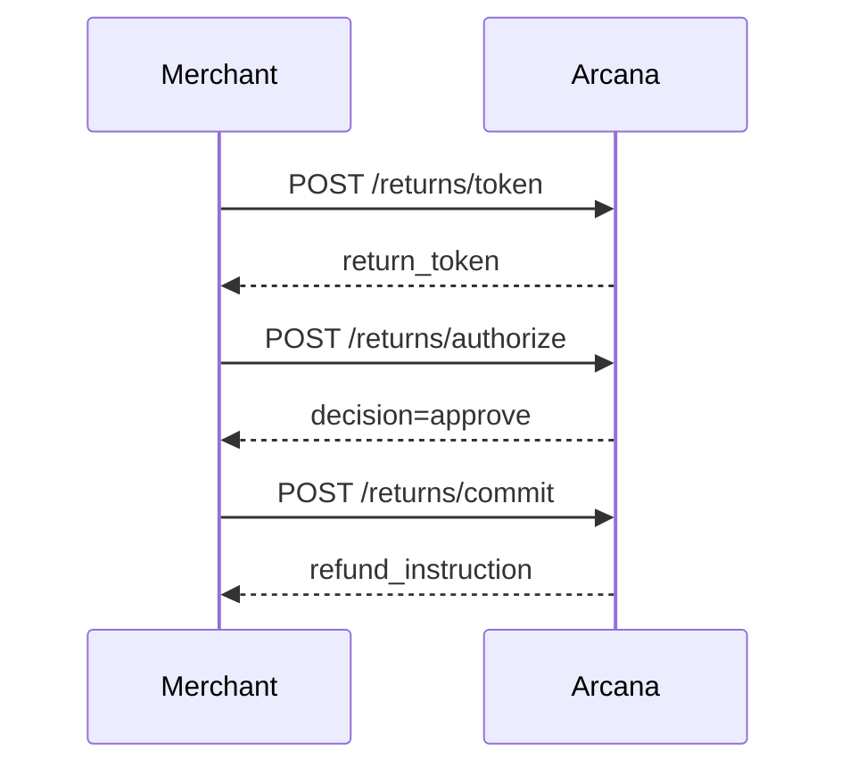

# How to Write Perfect API Documentation

> A comprehensive guide based on analysis of Arcana Returns API

## Executive Summary

Perfect API documentation balances **completeness** with **discoverability**. It should answer:
1. **What** can I do? (Capabilities)
2. **How** do I do it? (Examples)
3. **Why** does it work this way? (Context)
4. **What if** something goes wrong? (Errors)

---

## The 10 Principles of Perfect API Documentation

### 1. **Start with the Journey, Not the Endpoints**

❌ **Bad:** List all endpoints alphabetically
✅ **Good:** Show the user journey first, then dive into details

**Example from Arcana:**
```markdown
## Returns Flow
1. Issue Token → Get return_token
2. Collect Evidence → Call authorize
3. Ship Package → Call commit

Now let's explore each step...
```

**Why it matters:** Developers need to understand the "story" before memorizing endpoints.

---

### 2. **Show Full Request AND Response Examples**

❌ **Bad:** Only show request schema
✅ **Good:** Complete request, response, and error examples

**Template:**

```markdown
### Endpoint Name

**Request:**
```http
POST /endpoint
Headers...
```json
{
  "field": "value"
}
```

**Success Response (200 OK):**
```json
{
  "result": "value"
}
```

**Error Response (400 Bad Request):**
```json
{
  "error": {
    "code": "ERR-001",
    "message": "Descriptive message"
  }
}
```
```

---

### 3. **Document Field Semantics, Not Just Types**

❌ **Bad:**
```typescript
customer_ref: string
```

✅ **Good:**
```typescript
customer_ref: string;  // Pseudonymous customer ID (not email/PII)
                       // Format: cust_[alphanumeric]
                       // Used for fraud detection correlation
```

**Key Questions to Answer:**
- What format is expected?
- What is it used for?
- Is it customer-facing or internal?
- Can it change over time?

---

### 4. **Error Documentation Must Be Actionable**

Every error code needs:
1. **When** it occurs
2. **Why** it occurs
3. **How** to fix it

**Example:**

| Code | Condition | Cause | Resolution |
|------|-----------|-------|------------|
| RT-004 | Token expired | Return token TTL is 15 min | Issue a new token via `/returns/token` |
| RT-010 | Policy mismatch | Policy changed between token & authorize | Re-issue token with current policy_id |

**Anti-pattern:**
```
Error 500: Internal Server Error
```

**Better:**
```
Error RT-500: Decision processing failed
Cause: Model inference timeout
Resolution: Retry request. If persists, contact support with trace_id
```

---

### 5. **Visual Diagrams for Complex Flows**

Use sequence diagrams, flowcharts, and state machines.

**Mermaid Example:**
```markdown

```

**State Machine for Token Lifecycle:**
```
issued → verified → authorized → committed → revoked
   ↓                    ↓
expired              denied
```

---

### 6. **SDK Examples in Multiple Languages**

Show the same operation in 3+ languages:

```markdown
### Node.js
```javascript
const token = await arcana.returns.issueToken({...});
```

### Python
```python
token = arcana.returns.issue_token(...)
```

### Ruby
```ruby
token = arcana.returns.issue_token(...)
```

### cURL (for testing)
```bash
curl -X POST https://api.arcana.returns/returns/token \
  -H "Authorization: Bearer sk_..." \
  -d '{...}'
```
```

---

### 7. **Separate Reference from Guides**

**API Reference:**
- Comprehensive endpoint docs
- All parameters and responses
- Error codes
- Technical precision

**Guides:**
- Quickstart tutorials
- Common patterns
- Best practices
- Integration guides

**Arcana Structure:**
```
docs/
├── api-reference.md          # Complete endpoint reference
├── quickstart.md             # Get started in 5 minutes
├── guides/
│   ├── shopify-integration.md
│   ├── replay-debugging.md
│   └── security-best-practices.md
└── recipes/
    ├── handling-high-risk.md
    └── custom-evidence.md
```

---

### 8. **Document the "Why" Behind Design Decisions**

**Example from Arcana:**

```markdown
## Why Return Tokens (RT)?

**Problem:** Traditional API keys can't encode context about a specific return.

**Solution:** Short-lived, signed JWTs that bind:
- Policy snapshot (via hash)
- Items being returned
- Risk assessment

**Benefits:**
1. Prevents policy-switch attacks
2. Enables stateless authorization
3. Provides audit trail
4. Expires automatically (15 min)

**Trade-off:** Requires token management on client side
```

This helps developers understand architectural choices and build better integrations.

---

### 9. **Make Documentation Testable**

Every example should be copy-pastable and runnable.

**Best Practice:**
1. Use `.http` files for API examples
2. Provide Postman/Insomnia collections
3. Include integration test examples
4. Show environment variable setup

**Example:**

```markdown
### Environment Setup

```bash
export ARCANA_API_KEY="sk_test_..."
export ARCANA_BASE_URL="https://sandbox-api.arcana.returns"
```

### Test the API

```bash
# 1. Issue token
TOKEN_RESPONSE=$(curl -X POST $ARCANA_BASE_URL/returns/token \
  -H "Authorization: Bearer $ARCANA_API_KEY" \
  -H "Content-Type: application/json" \
  -d '{"order_id":"test_001",...}')

RETURN_TOKEN=$(echo $TOKEN_RESPONSE | jq -r '.return_token')

# 2. Authorize
curl -X POST $ARCANA_BASE_URL/returns/authorize \
  -H "Authorization: Bearer $ARCANA_API_KEY" \
  -d "{\"return_token\":\"$RETURN_TOKEN\",...}"
```
```

---

### 10. **Keep Documentation Synchronized with Code**

**Strategies:**

#### A. Generate Docs from Code
```typescript
// src/routes/returns.ts

/**
 * @openapi
 * /returns/token:
 *   post:
 *     summary: Issue a Return Token
 *     tags: [Returns]
 *     requestBody:
 *       required: true
 *       content:
 *         application/json:
 *           schema:
 *             $ref: '#/components/schemas/TokenRequest'
 */
server.post('/token', async (request, reply) => {
  // implementation
});
```

Generate OpenAPI spec:
```bash
npm run docs:generate
```

#### B. Validate Examples Against Live API
```typescript
// tests/docs-validation.test.ts

describe('Documentation Examples', () => {
  it('should match example in docs/api-reference.md', async () => {
    const response = await fetch('/returns/token', {
      method: 'POST',
      body: JSON.stringify(DOCS_EXAMPLE),
    });
    
    expect(response.status).toBe(200);
    expect(response.body).toMatchSchema(TokenResponseSchema);
  });
});
```

#### C. Use Type Definitions as Source of Truth

Export Zod schemas for documentation:

```typescript
// Auto-generated from Zod schemas
export const TokenRequestSchema = {
  type: 'object',
  properties: {
    order_id: { type: 'string', description: 'Order identifier' },
    // ...
  },
  required: ['order_id', 'customer_ref', 'items', 'policy_id'],
};
```

---

## Documentation Structure Template

### Minimal Complete Documentation

```markdown
# API Name

## Quick Start
- Installation
- Authentication
- First API call
- Next steps

## Core Concepts
- Domain model
- Key abstractions
- Workflow overview

## API Reference
### Resource 1
  #### GET /resource
    - Parameters
    - Request example
    - Response example
    - Error codes
  #### POST /resource
    - ...

### Resource 2
  ...

## Webhooks
- Verification
- Event types
- Payload examples

## Error Handling
- Error format
- Error codes table
- Retry logic

## Rate Limits & Quotas

## Security
- Authentication
- Authorization
- Best practices

## SDKs & Libraries
- Official SDKs
- Community libraries

## Changelog & Versioning
- Current version
- Breaking changes policy
- Migration guides

## Support
- Contact information
- Status page
- Community forums
```

---

## Advanced Topics

### Interactive Documentation

**Tools:**
- **Swagger UI / Redoc**: OpenAPI-based
- **ReadMe**: Rich, interactive docs
- **Stoplight**: API design + docs
- **Docusaurus**: Custom static site

**Features to Include:**
- "Try it" buttons for live API calls
- Code snippet generation in multiple languages
- Search with autocomplete
- Dark mode toggle
- Versioned docs (v1, v2)

### Accessibility

1. **Screen reader friendly**
   - Semantic HTML
   - Alt text for diagrams
   - Keyboard navigation

2. **Color contrast**
   - Syntax highlighting readable
   - Error states clearly marked

3. **Mobile responsive**
   - Works on phone/tablet
   - Readable code blocks

### Internationalization

For global APIs:
- Translate documentation to key markets
- Keep code examples in English
- Localize error messages
- Show currency/date format conventions

---

## Metrics for Documentation Quality

Track these metrics to improve docs:

1. **Time to First Successful API Call**
   - Goal: < 15 minutes from signup

2. **Support Ticket Topics**
   - If many tickets about same topic → docs need improvement

3. **Search Queries**
   - What are developers searching for?
   - Are they finding answers?

4. **Page Analytics**
   - Which pages are most visited?
   - Where do users drop off?

5. **Developer Satisfaction (CSAT)**
   - Survey: "Did this documentation help you?"

---

## Common Pitfalls to Avoid

### 1. Assuming Knowledge

❌ "Use the standard OAuth2 flow"
✅ "Authenticate using OAuth2. Here's a step-by-step guide..."

### 2. Incomplete Error Documentation

❌ Lists error codes without explanations
✅ Every error has cause + resolution

### 3. Stale Examples

❌ Examples use deprecated fields
✅ CI tests validate all examples

### 4. No Versioning

❌ Breaking changes without warning
✅ Clear migration path with deprecation timeline

### 5. Missing Context

❌ "Set the risk_score parameter"
✅ "risk_score (0-1) influences evidence requirements. Higher scores require more verification."

### 6. Over-Engineering

❌ 50-page guide for a simple API
✅ Quick start in 5 min, deep dives available

---

## Documentation Maintenance Checklist

### Every Release
- [ ] Update changelog
- [ ] Validate all code examples
- [ ] Update version numbers
- [ ] Mark deprecated features
- [ ] Add new endpoints/fields

### Monthly
- [ ] Review support tickets for doc gaps
- [ ] Update SDKs and libraries list
- [ ] Check for broken links
- [ ] Update performance metrics (rate limits, SLAs)

### Quarterly
- [ ] Developer satisfaction survey
- [ ] Analytics review (most visited pages, search terms)
- [ ] Competitive documentation audit
- [ ] Accessibility audit

---

## Tools & Resources

### Documentation Generators
- **OpenAPI/Swagger**: REST API standard
- **GraphQL**: Built-in schema introspection
- **gRPC**: Protocol buffers → docs
- **TypeDoc**: TypeScript API docs
- **Sphinx**: Python documentation

### Writing Tools
- **Vale**: Linting for prose
- **Grammarly**: Grammar checking
- **Hemingway**: Readability scoring
- **Carbon**: Beautiful code screenshots

### Diagramming
- **Mermaid**: Diagrams as code
- **Excalidraw**: Hand-drawn style
- **Lucidchart**: Professional diagrams
- **Figma**: Design tool with dev handoff

### Testing
- **Postman**: API testing and documentation
- **Bruno**: Open-source API client
- **HTTPie**: Human-friendly curl
- **k6**: Load testing with scripts

---

## Case Studies

### Stripe
**What they do well:**
- Progressive disclosure (quick start → advanced)
- Live API key switching
- Copy-paste code examples
- Excellent error messages

### Twilio
**What they do well:**
- Video tutorials
- Sample apps in GitHub
- Multi-language SDKs
- Community-contributed content

### GitHub
**What they do well:**
- Versioned documentation
- REST + GraphQL in one place
- Clear deprecation notices
- Extensive webhooks documentation

---

## Arcana Returns: Specific Recommendations

Based on the codebase analysis, here are tailored recommendations:

### Priority 1: High Impact, Quick Wins

1. **Add Mermaid sequence diagrams** to the 3-step returns flow
2. **Document token lifecycle** states (issued → authorized → committed → expired)
3. **Create error code reference** with resolution steps
4. **Add field descriptions** to all Zod schemas as JSDoc comments
5. **Publish example `.http` file** in docs/

### Priority 2: Medium Term

1. **Generate OpenAPI spec** from Zod schemas + Fastify routes
2. **Create integration guide** for Shopify merchants
3. **Build replay debugging tutorial** with real examples
4. **Add SDK examples** in Python, Ruby, Go
5. **Document webhook verification** with code examples

### Priority 3: Long Term

1. **Interactive docs** with "Try it" buttons
2. **Video tutorials** for common flows
3. **Developer portal** with API keys management
4. **Sandbox environment** with test data
5. **Community forum** for developer questions

### Immediate Actions

1. **Use the enhanced API reference** (`api-reference-enhanced.md`) as the new standard
2. **Add inline JSDoc** to all Zod schemas with descriptions
3. **Create `examples/` directory** with runnable scripts
4. **Set up CI job** to validate documentation examples
5. **Add changelog entry** for every release

---

## Example: Converting Code to Great Documentation

### From Code...

```typescript
// src/types/returns.ts
export const TokenRequestSchema = z.object({
  order_id: z.string(),
  customer_ref: z.string(),
  items: z.array(ReturnItemSchema).min(1),
  reason_code: z.string(),
  policy_id: z.string(),
});
```

### To Documentation...

```markdown
### POST /returns/token

Issue a Return Token to begin the returns flow.

**Request Body:**

| Field | Type | Required | Description |
|-------|------|----------|-------------|
| `order_id` | string | Yes | Your order identifier. Example: `ord_123456` |
| `customer_ref` | string | Yes | Pseudonymous customer ID (not PII). Format: `cust_[alphanum]` |
| `items` | array | Yes | Items to return. Min 1 item. See [ReturnItem schema](#returnitem) |
| `reason_code` | string | Yes | Return reason. One of: `doesnt_fit`, `damaged`, `wrong_item`, `changed_mind`, `not_as_described`, `quality_issue`, `other` |
| `policy_id` | string | Yes | Target policy ID. Example: `plc_abc123` |

**Example Request:**

```bash
curl -X POST https://api.arcana.returns/returns/token \
  -H "Authorization: Bearer sk_live_..." \
  -H "Content-Type: application/json" \
  -d '{
    "order_id": "ord_123456",
    "customer_ref": "cust_abc789",
    "items": [
      {
        "sku": "SHIRT-M-BLUE",
        "qty": 1,
        "price_cents": 2999
      }
    ],
    "reason_code": "doesnt_fit",
    "policy_id": "plc_xyz123"
  }'
```

**Success Response (200 OK):**

```json
{
  "return_token": "rt.eyJhbGc...",
  "risk_score": 0.12,
  "required_evidence": ["photo_packaging"],
  "policy_snapshot_hash": "sha256:a4b8...",
  "trace_id": "trc_9Nf2kL5p",
  "expires_at": "2025-10-26T19:20:00Z"
}
```

**Response Fields:**

| Field | Type | Description |
|-------|------|-------------|
| `return_token` | string | Signed JWT. Pass to `/returns/authorize` and `/returns/commit`. TTL: 15 minutes |
| `risk_score` | number | Risk score 0.0-1.0. Higher = more evidence required |
| `required_evidence` | string[] | Evidence types needed for authorization |
| `policy_snapshot_hash` | string | SHA-256 hash of policy. Immutable binding |
| `trace_id` | string | Request trace ID for debugging |
| `expires_at` | string | ISO 8601 timestamp when token expires |

**Error Responses:**

| Status | Code | Description | Resolution |
|--------|------|-------------|------------|
| 400 | RT-001 | Malformed request | Check request schema matches docs |
| 404 | POL-001 | Policy not found | Verify `policy_id` exists |
| 422 | RT-003 | Outside return window | Items past return window per policy |

**Next Steps:**

After receiving the token:
1. Collect required evidence from customer
2. Call [POST /returns/authorize](#post-returnsauthorize)
```
```

---

## Conclusion

Perfect API documentation is:
1. **Complete** - Covers all functionality
2. **Accurate** - Matches implementation
3. **Discoverable** - Easy to navigate
4. **Actionable** - Examples you can copy
5. **Maintained** - Stays up to date

Use this guide to transform code into developer-friendly documentation that accelerates integration and reduces support burden.

---

## Next Steps for Arcana Returns

1. **Adopt** `api-reference-enhanced.md` as the canonical reference
2. **Generate** OpenAPI spec from Zod schemas
3. **Create** integration guides for Shopify, Stripe, custom platforms
4. **Build** interactive documentation with live API testing
5. **Measure** documentation effectiveness with developer surveys

**Remember:** Great documentation is a product feature, not an afterthought. Invest accordingly.
