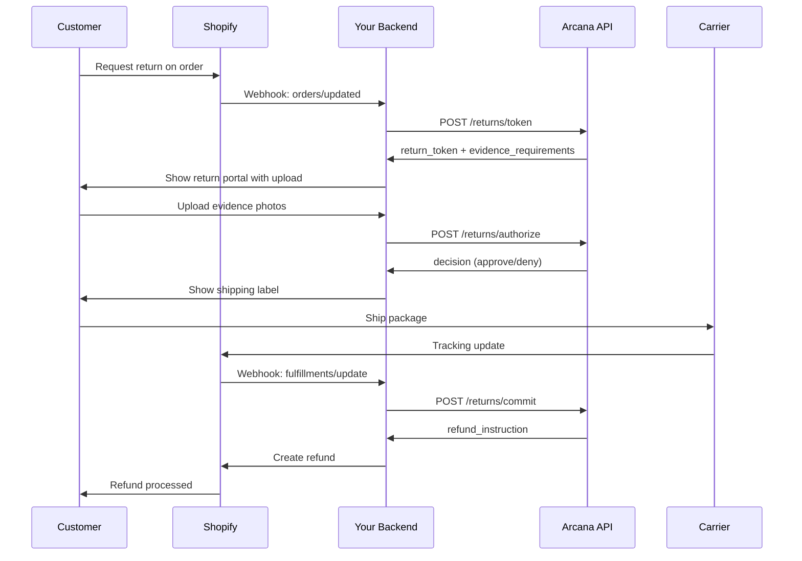

# Shopify Integration Guide

**Complete guide to integrating Arcana Returns with your Shopify store**

---

## Overview

This guide shows you how to integrate Arcana Returns into your Shopify store to provide intelligent, policy-driven returns.

### What You'll Build

- Webhook handlers for Shopify events
- Custom return portal for customers
- Automatic refund processing
- Evidence collection flow

### Architecture



---

## Prerequisites

- Active Shopify store (any plan)
- Arcana API key (`sk_live_...` or `sk_test_...`)
- Backend server (Node.js, Python, Ruby, or any language)
- Public HTTPS endpoint for webhooks

---

## Part 1: Shopify Setup

### 1. Create a Private App

**Shopify Admin → Settings → Apps and sales channels → Develop apps**

1. Click "Create an app"
2. Name it "Arcana Returns"
3. Configure Admin API scopes:
   - `read_orders`
   - `write_orders`
   - `read_customers`
   - `write_refunds`
   - `read_fulfillments`

4. Install the app
5. Save your Admin API access token

### 2. Set Up Webhooks

**Configure these webhooks to point to your backend:**

| Event | Endpoint | Purpose |
|-------|----------|---------|
| `orders/updated` | `https://your-backend.com/webhooks/shopify` | Customer requests return |
| `orders/fulfilled` | `https://your-backend.com/webhooks/shopify` | Order shipped (start return window) |
| `fulfillments/update` | `https://your-backend.com/webhooks/shopify` | Package tracking updates |

**Webhook Configuration:**
- Format: JSON
- API Version: 2024-10 (or latest)
- Include `X-Shopify-Hmac-Sha256` header

---

## Part 2: Backend Implementation

### Environment Variables

```bash
# .env
SHOPIFY_SHOP_DOMAIN=your-store.myshopify.com
SHOPIFY_API_KEY=your_shopify_api_key
SHOPIFY_API_SECRET=your_shopify_api_secret
SHOPIFY_ACCESS_TOKEN=your_admin_api_token
SHOPIFY_WEBHOOK_SECRET=your_webhook_secret

ARCANA_API_KEY=sk_live_your_arcana_key
ARCANA_BASE_URL=https://api.arcana.returns
ARCANA_POLICY_ID=plc_your_policy_id
```

### Webhook Verification

**Critical for security!** Always verify Shopify webhook signatures.

```javascript
// utils/shopify-verify.js
import crypto from 'crypto';

export function verifyShopifyWebhook(body, hmacHeader, secret) {
  const hash = crypto
    .createHmac('sha256', secret)
    .update(body, 'utf8')
    .digest('base64');
  
  return crypto.timingSafeEqual(
    Buffer.from(hash),
    Buffer.from(hmacHeader)
  );
}
```

### Webhook Handler

```javascript
// routes/webhooks.js
import express from 'express';
import { verifyShopifyWebhook } from '../utils/shopify-verify.js';
import { handleOrderUpdate } from '../handlers/order-update.js';

const router = express.Router();

router.post('/shopify', express.raw({ type: 'application/json' }), async (req, res) => {
  // 1. Verify webhook signature
  const hmac = req.headers['x-shopify-hmac-sha256'];
  const topic = req.headers['x-shopify-topic'];
  const shop = req.headers['x-shopify-shop-domain'];
  
  const isValid = verifyShopifyWebhook(
    req.body,
    hmac,
    process.env.SHOPIFY_WEBHOOK_SECRET
  );
  
  if (!isValid) {
    console.error('Invalid Shopify webhook signature');
    return res.status(401).send('Unauthorized');
  }
  
  // 2. Parse payload
  const payload = JSON.parse(req.body.toString());
  
  // 3. Handle event
  try {
    switch (topic) {
      case 'orders/updated':
        await handleOrderUpdate(payload, shop);
        break;
      
      case 'fulfillments/update':
        await handleFulfillmentUpdate(payload, shop);
        break;
      
      default:
        console.log(`Unhandled topic: ${topic}`);
    }
    
    res.status(200).send('OK');
  } catch (error) {
    console.error('Webhook handler error:', error);
    res.status(500).send('Error');
  }
});

export default router;
```

### Order Update Handler

```javascript
// handlers/order-update.js
import { issueReturnToken } from '../services/arcana.js';
import { createReturnPortalSession } from '../services/return-portal.js';
import { sendEmail } from '../services/email.js';

export async function handleOrderUpdate(order, shop) {
  // Check if customer requested a return
  const hasReturnRequest = checkForReturnRequest(order);
  
  if (!hasReturnRequest) {
    return;
  }
  
  console.log(`Return requested for order ${order.order_number}`);
  
  // 1. Issue Arcana return token
  const tokenResponse = await issueReturnToken({
    order_id: `shopify_${order.id}`,
    customer_ref: `shopify_cust_${order.customer.id}`,
    items: order.line_items.map(item => ({
      sku: item.sku || item.variant_id.toString(),
      qty: item.quantity,
      price_cents: Math.round(parseFloat(item.price) * 100),
      name: item.title,
    })),
    reason_code: extractReasonCode(order),
    policy_id: process.env.ARCANA_POLICY_ID,
  });
  
  // 2. Create return portal session
  const portalUrl = await createReturnPortalSession({
    order_id: order.id,
    return_token: tokenResponse.return_token,
    required_evidence: tokenResponse.required_evidence,
    customer_email: order.customer.email,
  });
  
  // 3. Send email to customer
  await sendEmail({
    to: order.customer.email,
    subject: `Return Request for Order #${order.order_number}`,
    template: 'return-initiated',
    data: {
      order_number: order.order_number,
      portal_url: portalUrl,
      required_evidence: tokenResponse.required_evidence,
      expires_at: tokenResponse.expires_at,
    },
  });
  
  console.log(`Return portal created: ${portalUrl}`);
}

function checkForReturnRequest(order) {
  // Check for return tag, note, or custom attribute
  return order.tags?.includes('return_requested') ||
         order.note?.includes('RETURN') ||
         order.note_attributes?.some(attr => attr.name === 'return_request');
}

function extractReasonCode(order) {
  // Extract from note attributes or default
  const reasonAttr = order.note_attributes?.find(
    attr => attr.name === 'return_reason'
  );
  return reasonAttr?.value || 'changed_mind';
}
```

### Arcana Service

```javascript
// services/arcana.js
export async function issueReturnToken(request) {
  const response = await fetch(`${process.env.ARCANA_BASE_URL}/returns/token`, {
    method: 'POST',
    headers: {
      'Authorization': `Bearer ${process.env.ARCANA_API_KEY}`,
      'Content-Type': 'application/json',
    },
    body: JSON.stringify(request),
  });
  
  if (!response.ok) {
    const error = await response.json();
    throw new Error(`Arcana API error: ${error.error?.code} - ${error.error?.message}`);
  }
  
  return response.json();
}

export async function authorizeReturn(returnToken, evidence) {
  const response = await fetch(`${process.env.ARCANA_BASE_URL}/returns/authorize`, {
    method: 'POST',
    headers: {
      'Authorization': `Bearer ${process.env.ARCANA_API_KEY}`,
      'Content-Type': 'application/json',
    },
    body: JSON.stringify({
      return_token: returnToken,
      evidence,
      dropoff_choice: 'mail_in',
    }),
  });
  
  if (!response.ok) {
    const error = await response.json();
    throw new Error(`Arcana API error: ${error.error?.code}`);
  }
  
  return response.json();
}

export async function commitReturn(returnToken, trackingInfo) {
  const response = await fetch(`${process.env.ARCANA_BASE_URL}/returns/commit`, {
    method: 'POST',
    headers: {
      'Authorization': `Bearer ${process.env.ARCANA_API_KEY}`,
      'Content-Type': 'application/json',
    },
    body: JSON.stringify({
      return_token: returnToken,
      receipt_event: trackingInfo,
    }),
  });
  
  if (!response.ok) {
    const error = await response.json();
    throw new Error(`Arcana API error: ${error.error?.code}`);
  }
  
  return response.json();
}
```

---

## Part 3: Return Portal

### Frontend (React Example)

```jsx
// components/ReturnPortal.jsx
import { useState } from 'react';

export function ReturnPortal({ returnToken, requiredEvidence, orderId }) {
  const [evidence, setEvidence] = useState([]);
  const [uploading, setUploading] = useState(false);
  const [decision, setDecision] = useState(null);
  
  const handleFileUpload = async (type, file) => {
    setUploading(true);
    
    // 1. Upload to your CDN/S3
    const uploadUrl = await uploadFile(file);
    
    // 2. Add to evidence list
    setEvidence(prev => [...prev, {
      type,
      url: uploadUrl,
      uploaded_at: new Date().toISOString(),
    }]);
    
    setUploading(false);
  };
  
  const handleSubmit = async () => {
    try {
      // Call your backend to authorize with Arcana
      const response = await fetch('/api/returns/authorize', {
        method: 'POST',
        headers: { 'Content-Type': 'application/json' },
        body: JSON.stringify({ returnToken, evidence }),
      });
      
      const result = await response.json();
      setDecision(result);
      
    } catch (error) {
      console.error('Authorization failed:', error);
      alert('Failed to process return. Please try again.');
    }
  };
  
  if (decision) {
    return (
      <div className="return-decision">
        {decision.decision === 'approve' ? (
          <>
            <h2>✅ Return Approved!</h2>
            <p>Your return has been approved. Here's what happens next:</p>
            <ul>
              <li>Download your prepaid shipping label</li>
              <li>Package your item(s) in original packaging</li>
              <li>Drop off at any {decision.carrier} location</li>
              <li>Refund will be processed within 3-5 business days</li>
            </ul>
            <button onClick={() => downloadLabel(decision.label_credential)}>
              Download Shipping Label
            </button>
          </>
        ) : (
          <>
            <h2>❌ Return Not Approved</h2>
            <p>We're unable to accept this return because:</p>
            <ul>
              {decision.explanations.map((exp, i) => (
                <li key={i}>{exp}</li>
              ))}
            </ul>
          </>
        )}
      </div>
    );
  }
  
  return (
    <div className="return-portal">
      <h2>Submit Return Evidence</h2>
      <p>Please upload the following to complete your return:</p>
      
      {requiredEvidence.map(evidenceType => (
        <div key={evidenceType} className="evidence-upload">
          <h3>{formatEvidenceType(evidenceType)}</h3>
          <input
            type="file"
            accept="image/*,application/pdf"
            onChange={(e) => handleFileUpload(evidenceType, e.target.files[0])}
            disabled={uploading}
          />
          {evidence.find(e => e.type === evidenceType) && (
            <span>✅ Uploaded</span>
          )}
        </div>
      ))}
      
      <button
        onClick={handleSubmit}
        disabled={evidence.length < requiredEvidence.length || uploading}
      >
        Submit Return Request
      </button>
    </div>
  );
}

function formatEvidenceType(type) {
  const labels = {
    'photo_packaging': 'Photo of Package',
    'photo_product': 'Photo of Product',
    'receipt': 'Purchase Receipt',
    'video': 'Video Evidence',
  };
  return labels[type] || type;
}
```

### Backend Portal Endpoint

```javascript
// routes/api.js
router.post('/returns/authorize', async (req, res) => {
  const { returnToken, evidence } = req.body;
  
  try {
    // Call Arcana to authorize
    const decision = await authorizeReturn(returnToken, evidence);
    
    // If approved, generate shipping label
    if (decision.decision === 'approve' && decision.label_credential) {
      const label = await generateShippingLabel(decision.label_credential);
      decision.label_url = label.url;
    }
    
    res.json(decision);
    
  } catch (error) {
    console.error('Authorization error:', error);
    res.status(500).json({ error: 'Failed to authorize return' });
  }
});
```

---

## Part 4: Refund Processing

### Fulfillment Update Handler

```javascript
// handlers/fulfillment-update.js
import { commitReturn } from '../services/arcana.js';
import { createShopifyRefund } from '../services/shopify.js';

export async function handleFulfillmentUpdate(fulfillment, shop) {
  // Check if this is a return shipment
  const returnToken = getReturnTokenFromFulfillment(fulfillment);
  
  if (!returnToken) {
    return; // Not a return
  }
  
  console.log(`Return package tracked: ${fulfillment.tracking_number}`);
  
  // 1. Commit return with Arcana
  const commitResponse = await commitReturn(returnToken, {
    type: 'scan',
    carrier: fulfillment.tracking_company,
    ts: new Date().toISOString(),
    tracking_number: fulfillment.tracking_number,
  });
  
  // 2. Process refund based on instruction
  if (commitResponse.refund_instruction === 'instant') {
    await processInstantRefund(fulfillment.order_id, commitResponse);
  } else if (commitResponse.refund_instruction === 'hold') {
    await scheduleInspectionRefund(fulfillment.order_id, commitResponse);
  }
  
  console.log(`Refund instruction: ${commitResponse.refund_instruction}`);
}

async function processInstantRefund(orderId, commitResponse) {
  const refundAmount = commitResponse.final_receipt.refund_amount_cents / 100;
  
  await createShopifyRefund({
    order_id: orderId,
    amount: refundAmount,
    reason: 'return',
    note: `Arcana Returns - Audit Ref: ${commitResponse.audit_ref}`,
  });
  
  console.log(`Instant refund processed: $${refundAmount}`);
}
```

### Shopify Refund Service

```javascript
// services/shopify.js
import Shopify from '@shopify/shopify-api';

export async function createShopifyRefund({ order_id, amount, reason, note }) {
  const client = new Shopify.Clients.Rest(
    process.env.SHOPIFY_SHOP_DOMAIN,
    process.env.SHOPIFY_ACCESS_TOKEN
  );
  
  const response = await client.post({
    path: `orders/${order_id}/refunds`,
    data: {
      refund: {
        currency: 'USD',
        notify: true,
        note: note,
        transactions: [{
          parent_id: order_id,
          amount: amount,
          kind: 'refund',
          gateway: 'manual',
        }],
      },
    },
  });
  
  return response.body.refund;
}
```

---

## Part 5: Testing

### Test in Shopify Development Store

1. **Create test order:**
   ```bash
   # Use Shopify's test credit card: 1 (Bogus Gateway)
   ```

2. **Trigger return:**
   ```bash
   # Add tag "return_requested" to order in Shopify Admin
   # Or use note attribute: return_request=true
   ```

3. **Verify webhook:**
   ```bash
   # Check your backend logs for webhook received
   # Verify HMAC validation passed
   ```

4. **Test return portal:**
   ```bash
   # Upload test images
   # Submit for authorization
   # Verify decision received
   ```

5. **Test refund:**
   ```bash
   # Simulate package scan
   # Verify refund created in Shopify
   ```

### Webhook Testing with ngrok

```bash
# Install ngrok
npm install -g ngrok

# Expose local server
ngrok http 3000

# Use ngrok URL in Shopify webhook settings
# https://abc123.ngrok.io/webhooks/shopify
```

---

## Part 6: Production Checklist

### Security

- [ ] Webhook signature verification enabled
- [ ] API keys stored in secure vault (not .env files)
- [ ] HTTPS enforced on all endpoints
- [ ] Rate limiting on webhook endpoints
- [ ] Evidence URLs use signed/temporary URLs
- [ ] Customer PII properly handled

### Shopify Configuration

- [ ] Webhooks configured in production store
- [ ] API scopes reviewed and minimized
- [ ] Webhook endpoint has high availability
- [ ] Retry logic for failed webhooks
- [ ] Webhook event logging

### Arcana Integration

- [ ] Using production API key (`sk_live_...`)
- [ ] Policy imported and reviewed
- [ ] Return flow tested end-to-end
- [ ] Error handling for all Arcana API calls
- [ ] Trace IDs logged for debugging

### Monitoring

- [ ] Webhook delivery monitoring
- [ ] Return authorization success rate
- [ ] Refund processing time
- [ ] Error alerting configured
- [ ] Customer support escalation path

---

## Troubleshooting

### Webhook Not Received

**Check:**
1. Webhook URL is publicly accessible (use ngrok for local testing)
2. HTTPS is enabled
3. Shopify webhook status shows "Sent"
4. Firewall/load balancer allows Shopify IPs

**Debug:**
```bash
# Check Shopify webhook delivery
# Admin → Settings → Notifications → Webhooks → View recent deliveries
```

### HMAC Validation Fails

**Common issues:**
- Using parsed JSON instead of raw body
- Incorrect webhook secret
- Body modification by middleware

**Fix:**
```javascript
// Use raw body for HMAC verification
app.post('/webhooks/shopify', express.raw({ type: 'application/json' }), ...)
```

### Return Token Expired

**Error:** `RT-004 - Token expired`

**Cause:** Customer took > 15 minutes to upload evidence

**Solution:**
```javascript
// Re-issue token if expired
if (error.code === 'RT-004') {
  const newToken = await issueReturnToken(originalRequest);
  // Update session with new token
}
```

### Refund Amount Mismatch

**Check:**
1. Arcana restocking fee calculation
2. Currency conversion
3. Shopify order currency
4. Tax handling

---

## Advanced Features

### Multi-Location Returns

```javascript
// Support in-store returns for specific locations
const returnLocations = await getShopifyLocations();

const nearestLocation = findNearestLocation(
  customerAddress,
  returnLocations
);

// Offer in-store return option
if (nearestLocation && policy.allowed_channels.includes('in_store')) {
  showInStoreOption(nearestLocation);
}
```

### Partial Returns

```javascript
// Customer returns only some items
const returnItems = selectedItems.map(item => ({
  sku: item.sku,
  qty: item.return_quantity, // Not full quantity
  price_cents: item.price_cents,
}));

const tokenResponse = await issueReturnToken({
  order_id: `shopify_${order.id}`,
  items: returnItems, // Partial item list
  // ...
});
```

### Custom Evidence Requirements

```javascript
// Adjust evidence based on item value
const isHighValue = items.some(item => item.price_cents > 10000);

if (isHighValue) {
  requiredEvidence.push('video');
  requiredEvidence.push('photo_defect');
}
```

---

## Next Steps

1. **Set up development environment**
   - Install dependencies
   - Configure environment variables
   - Test webhook verification

2. **Implement core flow**
   - Order update handler
   - Return portal
   - Refund processing

3. **Test thoroughly**
   - Happy path (approved return)
   - Edge cases (denied, expired token)
   - Error scenarios

4. **Deploy to production**
   - Use production Arcana API key
   - Configure Shopify webhooks
   - Monitor and iterate

---

## Resources

- [Shopify Webhooks Documentation](https://shopify.dev/docs/api/admin-rest/latest/resources/webhook)
- [Arcana API Reference](../api-reference-enhanced.md)
- [Shopify Refunds API](https://shopify.dev/docs/api/admin-rest/latest/resources/refund)

---

## Support

**Need help?**
- Shopify Integration Issues: shopify-support@arcana.returns
- API Questions: api-support@arcana.returns
- Slack: #shopify-integration
