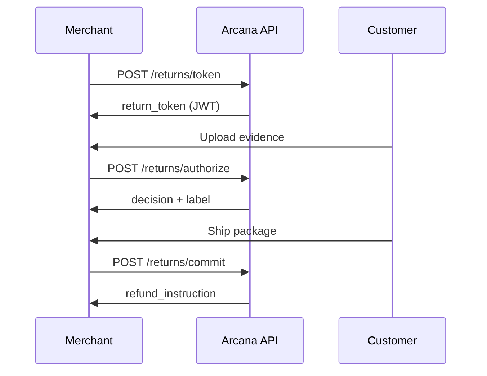

## Welcome to Arcana Returns

Arcana provides a minimal API surface for intelligent return decisions with complete auditability. Every decision is bound to a versioned policy snapshot and logged in an append-only ledger (AEL-lite) for time-travel replay.

<CardGroup cols={2}>
  <Card
    title="Quickstart"
    icon="rocket"
    href="/quickstart"
  >
    Get your first API call working in 5 minutes
  </Card>
  <Card
    title="API Reference"
    icon="code"
    href="/api-reference/returns/token"
  >
    Explore the complete API documentation
  </Card>
  <Card
    title="Shopify Integration"
    icon="bag-shopping"
    href="/guides/shopify-integration"
  >
    Integrate with your Shopify store
  </Card>
  <Card
    title="Examples"
    icon="book"
    href="/guides/examples/complete-flow"
  >
    Working code examples you can run immediately
  </Card>
</CardGroup>

## Features

<AccordionGroup>
  <Accordion icon="fingerprint" title="Policy Snapshot Extractor">
    Version-controlled policy graphs with content hashing. Import policies from PDF, URL, or text and track changes over time.
  </Accordion>
  <Accordion icon="rotate" title="3-Step Returns API">
    Simple, powerful API with just 3 endpoints: `/token`, `/authorize`, `/commit`. Signed Return Tokens with Ed25519 for security.
  </Accordion>
  <Accordion icon="book-open" title="AEL-lite Audit Ledger">
    Append-only decision ledger with replay capability. Every decision is logged with full Bill of Materials for compliance.
  </Accordion>
  <Accordion icon="plug" title="Platform Adapters">
    Pre-built integrations for Shopify and Stripe. Webhook-driven, easy to set up.
  </Accordion>
</AccordionGroup>

## Returns Flow Overview



## Quick Example

<CodeGroup>

```javascript Node.js
const response = await fetch('https://arcana-returns-api.fly.dev/returns/token', {
  method: 'POST',
  headers: {
    'Authorization': 'Bearer sk_live_...',
    'Content-Type': 'application/json',
  },
  body: JSON.stringify({
    order_id: 'ord_123',
    customer_ref: 'cust_456',
    items: [{ sku: 'SHIRT-M', qty: 1, price_cents: 2999 }],
    reason_code: 'doesnt_fit',
    policy_id: 'plc_abc'
  })
});

const { return_token } = await response.json();
```

```python Python
import requests

response = requests.post(
    'https://arcana-returns-api.fly.dev/returns/token',
    headers={
        'Authorization': 'Bearer sk_live_...',
        'Content-Type': 'application/json'
    },
    json={
        'order_id': 'ord_123',
        'customer_ref': 'cust_456',
        'items': [{'sku': 'SHIRT-M', 'qty': 1, 'price_cents': 2999}],
        'reason_code': 'doesnt_fit',
        'policy_id': 'plc_abc'
    }
)

return_token = response.json()['return_token']
```

```bash cURL
curl -X POST https://arcana-returns-api.fly.dev/returns/token \
  -H "Authorization: Bearer sk_live_..." \
  -H "Content-Type: application/json" \
  -d '{
    "order_id": "ord_123",
    "customer_ref": "cust_456",
    "items": [{"sku": "SHIRT-M", "qty": 1, "price_cents": 2999}],
    "reason_code": "doesnt_fit",
    "policy_id": "plc_abc"
  }'
```

</CodeGroup>

## Next Steps

<Steps>
  <Step title="Get API Keys">
    Sign up and create your API keys at [dashboard.arcana.returns](https://arcana.returns/dashboard)
  </Step>
  <Step title="Import Policy">
    Import your return policy via API or dashboard
  </Step>
  <Step title="Make Your First Call">
    Follow our [Quickstart](/quickstart) to issue your first return token
  </Step>
  <Step title="Integrate">
    Check out our [Shopify Integration Guide](/guides/shopify-integration)
  </Step>
</Steps>
